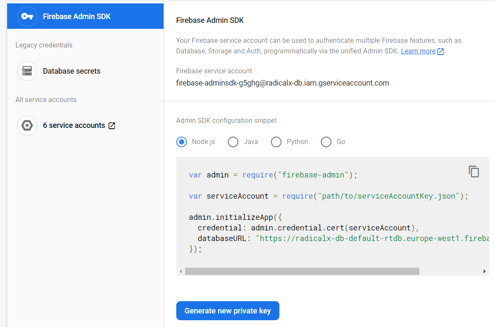

# Apprenticeship Backend
The core backend for this product is fairly simple as the main feature is just about apprenticeships. Creating, updating and deleting, which is basically a CRUD application.

## Getting Started
### Installation
- Clone the repo and cd to it.
- Install all the dependencies: `npm i`
- Run The server: `npm run dev`

## Run The Tests
The tests heavily depend on the [Firebase Local Emulator Suite](https://firebase.google.com/docs/emulator-suite), to get started:
- Install the [Firebase CLI](https://firebase.google.com/docs/cli#install_the_firebase_cli) and Login to access the projects.
- Go to the project root dir and Initialize a Firebase Project : `firebase init`, this will generate 2 files `firebase.json` and `.firebaserc`:
    - `firebase.json` configuration file that lists your project configuration.
    - `.firebaserc` file that stores your project aliases.
- Make sure to select the project you created over Firebase Console to add, if you didn't : `firebase use --add` 
- Start the emulator: `firebase emulators:start`
- Run the tests: `npm test`

Notes:
- Choose ports that don't conflict with the any other running process.
- Make sure to choose: `auth` and `firestore` while selecting the emulator settings.
- ProTip: you can also download the Firebase Emulator UI.
- If you don't want to Initialize a firebase project, you can use the current configs but, you have to edit some properties like `project_id` in `firebase.json`.
- If you faced `'Error while making request: connect ECONNREFUSED ::1:9099`, make sure to export as : `export FIREBASE_AUTH_EMULATOR_HOST="127.0.0.1:9099"`

## The Folder Structure
A good defined architecture is the success key for any application.
If you're familiar with the [MVC](https://en.wikipedia.org/wiki/Model%E2%80%93view%E2%80%93controller) design pattern, you may find this one closely similar.

```
├── package.json
├── package-lock.json
├── README.md
├── docs // important docs about the project, like the postman files.
│     └── ...
├── src
│   ├── app.js // contains all the app setups for routes, middlewares, and others.
│   ├── server.js // works as an index point for the application.
│   ├── config // contains all the configs for the whole project like db, tests,,, etc.
│   │   └── ...
│   ├── helpers // helper functions that are all around the project, change once in one place
│   │   └── ...
│   ├── middlewares // the layer before the actual execution of the controller.
│   │   └── ...
│   ├── models // all the database schemes and datatypes.
│   │   └── ...
│   ├── modules // the entities of the product.
│   │   └── user
│   │       ├── user.controller.js
│   │       ├── user.routes.js
│   │       ├── user.service.js
│   │       ├── user.tests.js
│   │       └── user.validation.js
│   └── utils
├── tests // testing goes here
│   └── e2e
│   │   └── ...
│   └── unit
│       └── ...
```

As shown above, the structure is so simple as:
- all the source code is in one place `src/` 
- testing modules like e2e and unit testing in `tests/` 
- docs related files in `docs/`

The beauty of the code structure happens in the `src/` dir, as all the product stories' are translated into entities, in the `src/modules` (in our case we have 2+ user and apprenticeship).

Taking a deep dive into the `modules/`:

<p align="center">
    
</p>

1. When a request is being sent to the server, the first thing it hits in the main index is the `index.js/server.js` where the router decides which entityRoute to use.
    
    ```javascript
    // all the user requests like api/v1/user/login will be redirected to the userRoutes
    app.use(`api/v1/user/`, userRoutes)
    ```
2. Then matching happens in the `userRoutes` to check if that route exists and directs to a controller to handle the rest. It's worth mentioning that the controller is the main brain, as it can return the response and throw errors back to the client.

```javascript
import userController from './user.controller'
let router = Router()

// login a user
router.post('/login', userController.loginUser)
```

3. When the controller function related to login is called, some job is done, we can execute the login lines in the same controller but it's a bad practice as:
    - The controller gets really lengthy.
    - Hard to test.
    - Comments of unrelated entities will popup.

```javascript
const loginUser = async (req, res) => {
  try {
    
    // do the login thing
    const token = await userServices.getLoginToken(req.body)

    res.send({
        success: "logged in :D"
    })
  } catch (e) {
    res.status(e.code || 400).send({
        error : e.message
    })
  }
}
```
4. The service layer, which is responsible for managing the business rules, in our example login.

```javascript
const getLoginToken = async (data) => {
    // do the login related tasks here
}
```

Notes:
- A validation of the incoming data from frontend could be done in the controller: `user.validation.js`
- Implementing tests is plus: `user.tests.js`

## The API Design
Following the REST best practices, we can, for now, sketch some main simple routes based on the user stories.

- POST:  `/api/login/`
- POST:  `/api/forgot-password/`
- GET/POST/PUT: `/api/apprenticeship/`
    - GET by ID: `/api/apprenticeship/{id}`
    - GET all: `/api/apprenticeship/`
    - DELETE: `/api/apprenticeship/{id}`
    - PUT: `/api/apprenticeship/{id}`

## The Database Models

<p align="center">
    
</p>

That's the initial design for the database, thanks to @mohamedamr241

### Firebase
After creating a new project, to get the API key in the project's main page 
* Frontend Api key
    * Gear icon top left(Project overview) --> Project settings --> General --> your apps section --> SDK Setup and Configuration --> Choose your setup type and copy the text

<p align="center">
    
</p><br>

* Backend Api key
    * Gear icon top left(Project overview) --> Project settings --> Service accounts --> Generate new private key
    * Move the file to `src/config/firebase-admin-keys.json`

<p align="center">
    
</p>

Still having trouble? check this out: [Loom video](https://www.loom.com/share/7a5bcd474c71440cb5c40e0a1f5af879)
## Postamn Docs
In the next sprint we'll start documenting the API for the frontend devs.

## Refs
- [API Design Best Practices](https://stackoverflow.blog/2020/03/02/best-practices-for-rest-api-design/) 
